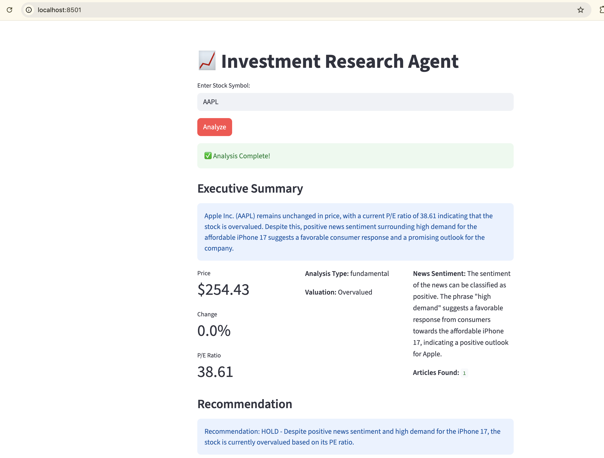

# Investment Research Multi-Agent System

An autonomous investment research system using 4 AI agents that work together to analyze stocks, demonstrating key agentic workflow patterns.

## Features

- **4 Specialized AI Agents** 
- **Real-time stock data** from Yahoo Finance
- **News sentiment analysis** from NewsAPI
- **Multiple workflow patterns** demonstrated
- **Self-reflection & evaluation** capabilities

## Architecture

### The 4 Agents

1. **Orchestrator Agent**
   - Plans the research workflow
   - Coordinates other agents
   - Reflects on overall execution

2. **Data Agent**
   - Collects stock market data (Yahoo Finance)
   - Fetches and processes news articles
   - Implements prompt chaining for news analysis

3. **Analysis Agent**
   - Routes to appropriate analysis type (technical/fundamental)
   - Performs market analysis
   - Self-evaluates and optimizes results

4. **Report Agent**
   - Generates comprehensive investment report
   - Creates recommendations
   - Identifies key risks

## 🔄 Workflow Patterns Demonstrated

1. **Prompt Chaining**: News --> Classify --> Extract --> Summarize
2. **Routing**: Dynamic specialist selection based on data
3. **Evaluator-Optimizer**: Generate --> Evaluate --> Refine
4. **Self-Reflection**: Each agent evaluates its own performance

## Quick Start

### Prerequisites

- Python 3.12
- OpenAI API key
- NewsAPI key

### Installation

1. Clone the repository:
```bash
git clone <your-repo-url>
cd final-project
```

2. Install dependencies:
```bash
pip install -r requirements.txt
```

3. Create a `.env` file:
```env
OPENAI_API_KEY=sk-openai-api-key
NEWS_API_KEY=newsapi-key  
```

### Running the Application

#### Streamlit Web Interface
```bash
streamlit run app.py
```
Open browser to `http://localhost:8501`


## Project Structure

```
./
├── app.py              # Streamlit web interface
├── agents.py           # All 4 agent implementations
├── config.py           # API configuration
├── requirements.txt    # Python dependencies
├── .env               # API keys (create this)
└── README.md          # This file
```

## Requirements

```txt
streamlit
langchain
langchain-openai
yfinance
pandas
python-dotenv
requests
newsapi-python
langchain-community
```

## API Keys

### OpenAI API Key (Required)
Get from: [https://platform.openai.com/api-keys](https://platform.openai.com/api-keys)

### NewsAPI Key (Optional)
Get free key from: [https://newsapi.org/register](https://newsapi.org/register)


## How It Works

1. **User inputs** a stock symbol (e.g., AAPL, MSFT, GOOGL)
2. **Orchestrator** plans the research workflow
3. **Data Agent** collects market data and news
4. **Analysis Agent** routes to appropriate analysis type
5. **Report Agent** generates final investment report
6. **System** displays recommendation and risks

## Example Output
